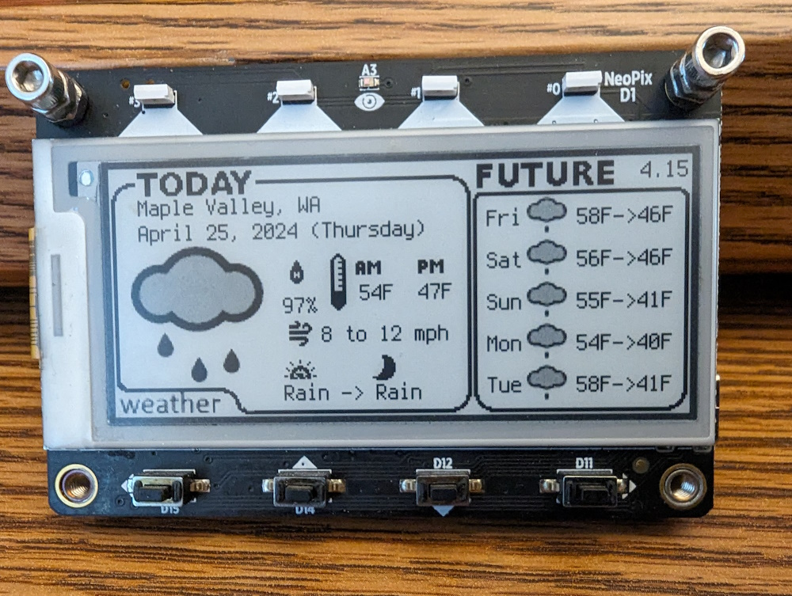

# SuperTag
Customized MagTag software for dynamic weather and financial updates https://learn.adafruit.com/adafruit-magtag

## About
**SuperTag** is a heavily modified mashup of the [MagTag Weather Forecast](https://learn.adafruit.com/magtag-weather/overview) tutorial with customized logic to display current financial information.

**04/25 Update**: Swapped from the OpenWeather API (used in that tutorial) to the NOAA API (which is not deprecated and doesn't require an API key)

## Summary
### Weather information
Weather data is automatically updated when the display is refreshed. The #2 neopixel is used to display network and computation status when the *weather* or *asset* buttons are pressed.

### Asset information
Asset data in **SuperTag** is an anonymized summary of how each asset category is performing. Asset allocations and overall performance metrics are automatically updated when the display is refreshed.

